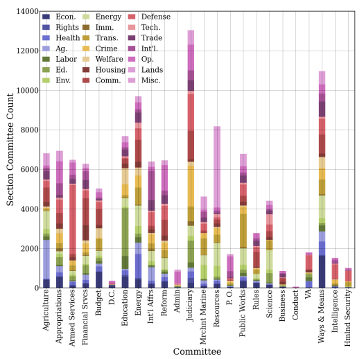
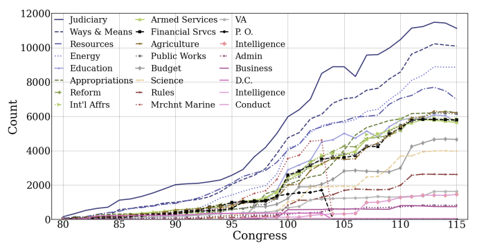
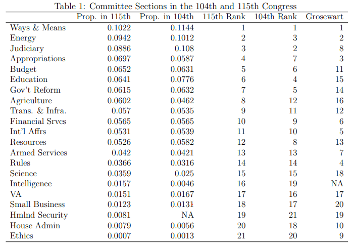

```{r setup, include=FALSE}
options(htmltools.dir.version = FALSE)
```

```{r xaringan-themer, include=FALSE, warning=FALSE}
library(xaringanthemer)
style_mono_accent(base_color = "#2F4F4F",
  header_font_google = google_font("Yanone Kaffeesatz","200","300","400","500","600","700"),
  text_font_google   = google_font("Roboto", "300", "300i","400","500"),
  code_font_google   = google_font("Fira Mono"),
  text_font_size = "125%", 
  colors = c(
  red = "#f34213",
  purple = "#3e2f5b",
  orange = "#ff8811",
  green = "#136f63",
  white = "#FFFFFF",
  gold = "#FFD700",
  crimson = "#8B0000"
),
extra_css = list(
    ".remark-slide table" = list("display" = "table",
                   "width" = "80%",
                   "text-align" = "left"),
    ".remark-slide-number" = list("display" = "%current%"),
    ".strong" = list("font-weight" = "400"),
    ".big" = list("font-size" = "350%",
                  "font-family" = "Yanone Kaffeesatz",
                  "font-weight"="400"),
    ".small" = list("font-size" = "80%"),
    ".large" = list("font-size" = "150%"))
)

```

# Agenda
- Committee Policy Influence
- Data
- Trends
- Conclusions

---

class: left, bottom, inverse
.big[Committee Policy Influence]

---

# Committee Policy Influence

- What is the role and authority of congressional committees in influencing federal policy?

- A measure of how influential each committee is among various issue areas in federal policy over time does not exist

- Using the United States Code, we propose a **_committee influence score_** that gauges the policy influence of
committees at a more granular level

---

class: left, bottom, inverse
.big[Data]

---

# United States Code (USC)

- Comprised of "general and permanent laws of the United States", broadly organized by subject matter into several dozen titles

- Contents of public law are categorized hierarchically using the Statutes at Large compiled at the end of each congressional session

  - Titles, subtitles, chapters, subchapters, sections, etc.
  
- Parsed XHTML files provided by the OLRC into provision-level data spanning 1994-2018 (103rd-115th Congresses)

- Used CAP coding scheme at the chapter level to categorize ~60,000 sections within the USC's 54 titles

---

# Committee Influence Score

- Based on the linkage between public laws and sections of the US Code ("source credit")

- A House committee (or multiple committees) gets credit for influence over a USC section if the committee was referred a bill that became law and that law either enacted or amended a section

- A committee gains influence over a section starting with the earliest law referred to the committee that altered the
section

- A section may have more than one committee attributed to it

- A committee is never dropped from a section even if a different committee amends that section in a subsequent year

- If a section is dropped from the USC, it is no longer counted as an influenced section by the relevant committee(s)

---

class: left, bottom, inverse
.big[Trends]

---

# Policy Areas Attributed to Sections

.center[]

---

# Distribution of Committee Influence Over Time

.center[]

---
# Distribution of Committee Influence Over Time

.center[]


---

class: left, bottom, inverse
.big[Conclusions]

---

# Conclusions

- The USC provides a substantial amount of information about lawmaking over time and in several policy areas

- Coupled with the CAP coding scheme, we created a committee influence score that captures the influence congressional committees have over federal policy and how this varies over time

- Our measure suggests there are no dominant committees consistently exercising control over federal policy; however, some do expand their influence, while others ebb and flow over time
 
---

class: left, bottom, inverse
.big[Thank you! Questions?]


